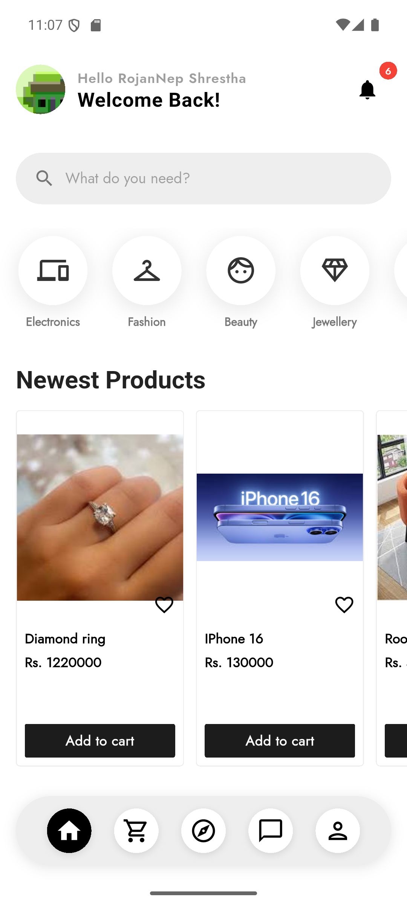
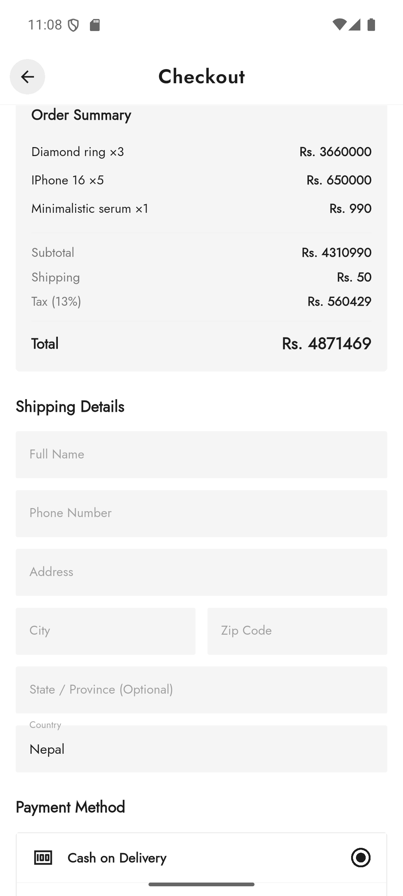
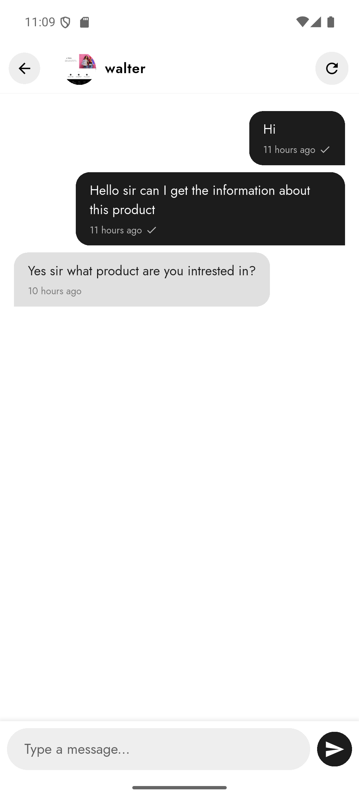

# 🛒 HamroDeal — Flutter E-Commerce App

A full-featured mobile e-commerce application built with Flutter and Dart. HamroDeal lets users browse products, manage a cart, place orders, and handle authentication — all from a clean, responsive mobile UI. The same backend also powers the [HamroDeal Web](https://github.com/RojanShrestha77/HamroDeal_Web) (Next.js) version.

---

## 📱 Screenshots

| Home | Product Detail | Cart | Orders |
|------|---------------|------|--------|
|  |  |  |  |

> More screenshots available in the repo root (flutter_02.png → flutter_35.png)

---

## ✨ Features

- 🔐 User registration & login with JWT authentication
- 🏠 Home feed with product listings and categories
- 🔍 Product search and filtering
- 🛍️ Product detail view with images and descriptions
- 🛒 Cart management (add, remove, update quantity)
- 📦 Order placement and order history
- 👤 User profile management
- 📱 Responsive UI for Android and iOS

---

## 🛠️ Tech Stack

| Layer | Technology |
|-------|-----------|
| Framework | Flutter |
| Language | Dart |
| State Management | — |
| HTTP Client | Dart http / dio |
| Auth | JWT |
| Backend | Node.js + Express + MongoDB ([HamroDealApp_backend](https://github.com/RojanShrestha77/HamroDealApp_backend)) |

---

## 🚀 Getting Started

### Prerequisites

- Flutter SDK (>=3.0.0)
- Dart SDK
- Android Studio / VS Code with Flutter plugin
- Backend server running ([see backend repo](https://github.com/RojanShrestha77/HamroDealApp_backend))

### Installation

```bash
# Clone the repo
git clone https://github.com/RojanShrestha77/HamroDeal.git
cd HamroDeal

# Install dependencies
flutter pub get

# Run the app
flutter run
```

> Make sure to update the API base URL in the project to point to your running backend instance.

---

## 📁 Project Structure

```
lib/
├── main.dart
├── screens/        # UI screens (home, product, cart, profile, etc.)
├── widgets/        # Reusable UI components
├── models/         # Data models
├── services/       # API service calls
└── utils/          # Helpers and constants
```

---

## 🔗 Related Repos

| Repo | Description |
|------|-------------|
| [HamroDeal_Web](https://github.com/RojanShrestha77/HamroDeal_Web) | Next.js + TypeScript web version |
| [HamroDealApp_backend](https://github.com/RojanShrestha77/HamroDealApp_backend) | Node.js + Express REST API (shared backend) |

---

## 👨‍💻 Author

**Rojan Shrestha** — [github.com/RojanShrestha77](https://github.com/RojanShrestha77)
